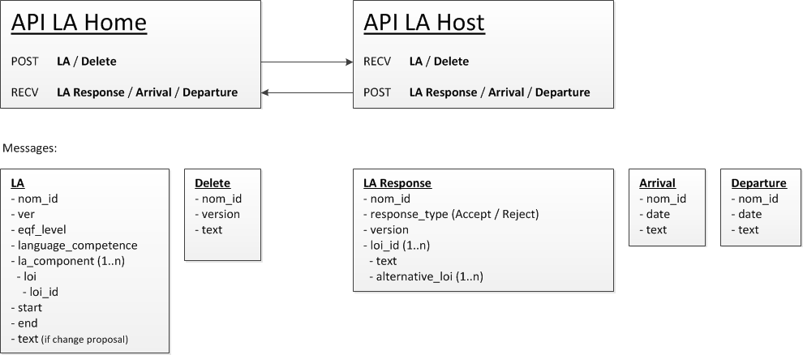

DEPRECATED - Learning Agreement API
======================

* [What is the status of this document?][statuses]
* [See the index of all other EWP Specifications][develhub]

Summary
-------

This document describes the API for Learning Agreements. Once implemented, institutions can exchange Learning Agreements for
a student.

Participants
------------

* **HOME** - The home institution is the institution where the student originates. It is the Home institution who, through
             the student, initiates a Learning Agreement.
* **HOST** - The host institution is where the student wants to study. The Host institution approves or rejects Learning 
             Agreements. This is done on a course level, meaning, that once the nomination is approved, the student has
             been approved for study, but it might not be clear if he is elligeble for the chosen courses.

Basic flow
----------

The Home institution sends a Learning Agreement to the Host institution. The Host institution either accepts or rejects the
Learning Agreement. The rejection happens on a course level (for instence, the student do not fullfill the requirements or
the course is cancelled for the upcoming semester). The Host can then, in their rejection, suggest alternatives. The Home
institution can also choose to delete a Learning Agreement, for instence if the student changes his mind. Upon arrival, the
Host institution can report that the student has arrived, same for departure.

Implementation
--------------

The LA-API will contain functionality for both the Home and the Host institution.

* **Home API** - The Home API can recieve Accept or Reject of a Learning agreement, as well as arrival and departure data
* **Host API** - The Host API can recieve a Learning Agreement or a Delete request
